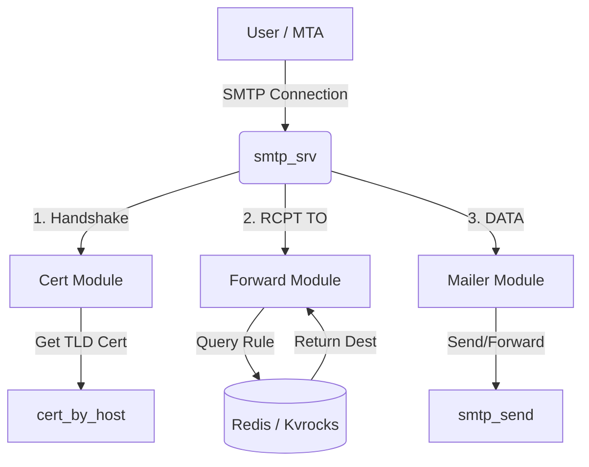
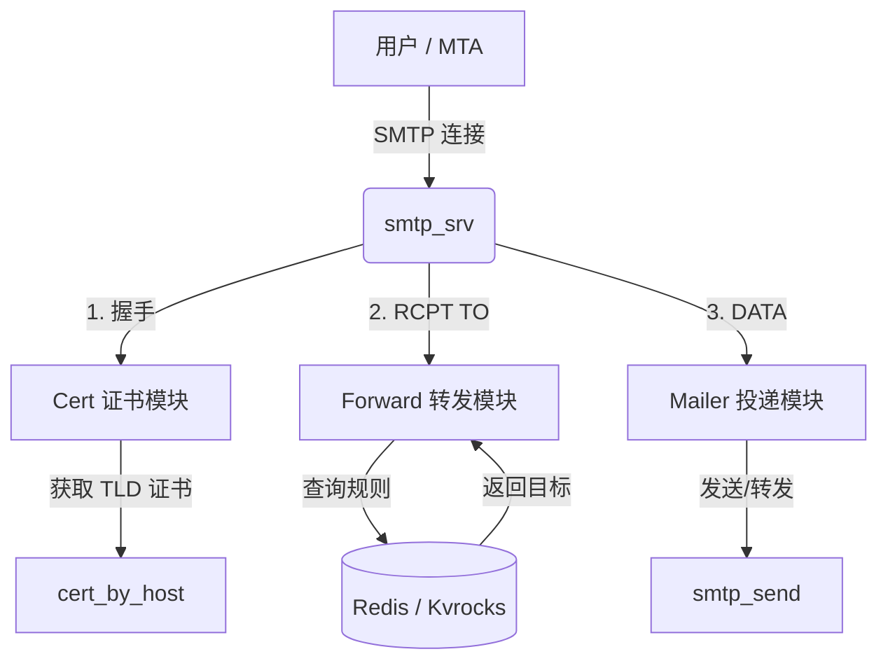

[English](#en) | [中文](#zh)

---

<a id="en"></a>

# smtp_srv : Auto-refreshing SMTPS server powered by Redis / Kvrocks

## Table of Contents
- [Introduction](#introduction)
- [Features](#features)
- [Usage](#usage)
- [Design](#design)
- [Exported API](#exported-api)
- [Tech Stack](#tech-stack)
- [Directory Structure](#directory-structure)
- [History](#history)

## Introduction
`smtp_srv` is a high-performance, asynchronous SMTPS server built with Rust. It is designed to work seamlessly with Redis or Kvrocks to manage mail forwarding rules dynamically. A key feature of this server is its ability to automatically refresh TLS certificates, ensuring secure and uninterrupted service. It serves as a robust implementations wrapper around `smtp_recv` and `smtp_send` libraries.

## Features
- **Auto-Refreshing TLS**: Automatically fetches and updates certificates based on the hostname TLD.
- **Dynamic Forwarding**: lookups forwarding rules in real-time from Redis/Kvrocks.
- **High Performance**: Built on the Tokio runtime for asynchronous I/O.
- **DKIM Support**: Integrated DKIM signing for outgoing mails.
- **Graceful Shutdown**: Handles system signals for safe termination.

## Usage

Add the dependency to `Cargo.toml`:

```toml
[dependencies]
smtp_srv = "0.2.19"
```

Entry point in `src/main.rs`:
```rust
use aok::{OK, Void};
use mimalloc::MiMalloc;

#[global_allocator]
static GLOBAL: MiMalloc = MiMalloc;

#[static_init::constructor(0)]
extern "C" fn _init() {
  log_init::init();
}

#[tokio::main]
async fn main() -> Void {
  xboot::init().await?;
  let _ = rustls::crypto::ring::default_provider().install_default();
  smtp_srv::run().await;
  OK
}
```

Run the server:
```bash
cargo run --release
```

## Design

The server operates by injecting specific implementations into the `smtp_recv` runner. The core logic handles the SMTP protocol, while `smtp_srv` provides the business logic for storage and security.

### Module Call Flow

1.  **Reception**: `smtp_recv` accepts the connection.
2.  **Certification**: `Cert` module determines the certificate to use based on the incoming host (extracts TLD).
3.  **Forwarding**: `Forward` module checks Redis for the `mailForward:<host>` key to determine the destination.
4.  **Delivery**: `Mailer` module uses `smtp_send` to dispatch the email.



## Exported API

The library exports the following main components from `src/lib.rs`:

### Functions
-   `run()`: The main async entry point. It sets up the server with `Forward`, `AuthEnv`, `Mailer`, and `Cert` implementations and waits for the shutdown signal.

### Structs
-   `Cert` (`src/cert.rs`): Implements `ssl_trait::CertByHost`. Resolves certificates by normalizing the host to its top-level domain.
-   `Forward` (`src/forward.rs`): Implements `mail_forward::Forward`. Connects to the Redis/Kvrocks backend to retrieve forwarding configurations using the `xkv` client. Supports both single-entry and batch lookups.
-   `Mailer` (`src/mailer.rs`): Implements `smtp_recv::Mailer`. Handles the final delivery of emails using the `smtp_send` library, configured with DKIM keys.

## Tech Stack

-   **Runtime**: [Tokio](https://tokio.rs/)
-   **Language**: Rust
-   **Database**: Redis / Kvrocks (via [fred](https://github.com/aweinstock314/rust-fred))
-   **TLS**: [rustls](https://github.com/rustls/rustls)
-   **Core Modules**: `smtp_recv`, `smtp_send`, `cert_by_host`

## Directory Structure

```
src/
├── cert.rs       # TLS Certificate resolution logic
├── forward.rs    # Mail forwarding rules lookup (Redis/Kvrocks)
├── lib.rs        # Library exports and run function
├── mailer.rs     # Mail sending implementation
└── main.rs       # Application entry point
```

## History

The first email was sent by Ray Tomlinson in 1971. He originally needed a way to separate the user name from the computer name, and looked down at his keyboard for a symbol that wasn't used in names. He chose the **@** symbol. The content of that first email is often forgotten, but Tomlinson recalls it was something insignificant, likely "QWERTYUIOP" or similar test characters. This simple choice of a separator fundamentally shaped the digital communication identity we use today.

---

## About

This project is an open-source component of [js0.site ⋅ Refactoring the Internet Plan](https://js0.site).

We are redefining the development paradigm of the Internet in a componentized way. Welcome to follow us:

* [Google Group](https://groups.google.com/g/js0-site)
* [js0site.bsky.social](https://bsky.app/profile/js0site.bsky.social)

---

<a id="zh"></a>

# smtp_srv : 基于 Redis / Kvrocks 自动热更新证书的 SMTPS 服务器

## 目录
- [简介](#简介)
- [功能特性](#功能特性)
- [使用演示](#使用演示)
- [设计思路](#设计思路)
- [API 接口](#api-接口)
- [技术栈](#技术栈)
- [目录结构](#目录结构)
- [历史趣闻](#历史趣闻)

## 简介
`smtp_srv` 是一款高性能、异步的 Rust SMTPS 服务器。它专为与 Redis 或 Kvrocks 配合使用而设计，用以动态管理邮件转发规则。该项目的核心亮点在于能够根据请求域名自动刷新 TLS 证书，确保证书时刻有效且安全。它是 `smtp_recv` 和 `smtp_send` 库的具体业务实现封装。

## 功能特性
- **证书自动热更新**：根据主机名 TLD 自动获取和更新证书。
- **动态转发规则**：从 Redis/Kvrocks 实时查询转发配置。
- **高性能架构**：基于 Tokio 运行时构建，处理大规模异步 I/O。
- **DKIM 签名**：集成对发件的 DKIM 签名支持。
- **优雅停机**：支持系统信号监听，实现安全停机。

## 使用演示

在 `Cargo.toml` 添加依赖：

```toml
[dependencies]
smtp_srv = "0.2.19"
```

`src/main.rs` 入口文件示例：
```rust
use aok::{OK, Void};
use mimalloc::MiMalloc;

#[global_allocator]
static GLOBAL: MiMalloc = MiMalloc;

#[static_init::constructor(0)]
extern "C" fn _init() {
  log_init::init();
}

#[tokio::main]
async fn main() -> Void {
  xboot::init().await?;
  let _ = rustls::crypto::ring::default_provider().install_default();
  smtp_srv::run().await;
  OK
}
```

运行服务器：
```bash
cargo run --release
```

## 设计思路

服务器通过将具体实现注入到 `smtp_recv` 运行器来工作。核心协议逻辑由 `smtp_recv` 处理，而 `smtp_srv` 提供与存储和安全相关的业务逻辑。

### 模块调用流程

1.  **连接接收**：`smtp_recv` 接受客户端连接。
2.  **证书匹配**：`Cert` 模块根据请求 Host 解析（提取 TLD）并提供对应证书。
3.  **转发查询**：`Forward` 模块检查 Redis 中的 `mailForward:<host>` 键以确定转发目标。
4.  **邮件投递**：`Mailer` 模块调用 `smtp_send` 将邮件发送至目标。



## API 接口

项目在 `src/lib.rs` 中导出了以下主要组件：

### 函数
-   `run()`: 异步主入口函数。它使用 `Forward`、`AuthEnv`、`Mailer` 和 `Cert` 的具体实现来初始化服务器，并等待停机信号。

### 数据结构
-   `Cert` (`src/cert.rs`): 实现 `ssl_trait::CertByHost`。通过将主机名规范化为顶级域（TLD）来解析证书。
-   `Forward` (`src/forward.rs`): 实现 `mail_forward::Forward`。使用 `xkv` 客户端连接 Redis/Kvrocks 后端以检索转发配置，支持单条和批量查询。
-   `Mailer` (`src/mailer.rs`): 实现 `smtp_recv::Mailer`。使用配置了 DKIM 密钥的 `smtp_send` 库处理邮件的最终投递。

## 技术栈

-   **运行时**: [Tokio](https://tokio.rs/)
-   **编程语言**: Rust
-   **数据库**: Redis / Kvrocks (通过 [fred](https://github.com/aweinstock314/rust-fred))
-   **TLS**: [rustls](https://github.com/rustls/rustls)
-   **核心组件**: `smtp_recv`, `smtp_send`, `cert_by_host`

## 目录结构

```
src/
├── cert.rs       # TLS 证书解析逻辑
├── forward.rs    # 邮件转发规则查询 (Redis/Kvrocks)
├── lib.rs        # 库导出及运行函数
├── mailer.rs     # 邮件发送实现
└── main.rs       # 应用入口点
```

## 历史趣闻

第一封电子邮件是由 Ray Tomlinson 在 1971 年发出的。他最初需要一种方法将用户名与计算机名区分开来，于是低头看了看键盘，寻找一个在名字中不常出现的符号。他选中了 **@** 符号。那封邮件的具体内容如今已无人记得，Tomlinson 回忆说那只是一些无关紧要的测试字符，很可能是 "QWERTYUIOP"。这个简单的分隔符选择，从根本上定义了我们要至今沿用的数字身份标识方式。

---

## 关于

本项目为 [js0.site ⋅ 重构互联网计划](https://js0.site) 的开源组件。

我们正在以组件化的方式重新定义互联网的开发范式，欢迎关注：

* [谷歌邮件列表](https://groups.google.com/g/js0-site)
* [js0site.bsky.social](https://bsky.app/profile/js0site.bsky.social)
