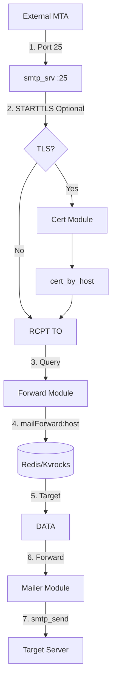
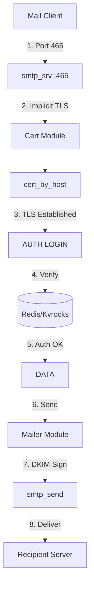

# smtp_srv : High-Performance SMTPS Server with Auto-Refreshing Certificates

## Table of Contents
- [Introduction](#introduction)
- [Features](#features)
- [Architecture](#architecture)
- [Usage](#usage)
- [Exported API](#exported-api)
- [Tech Stack](#tech-stack)
- [Directory Structure](#directory-structure)
- [History](#history)

## Introduction

`smtp_srv` is an asynchronous SMTPS server built with Rust, designed for high-performance mail handling with Redis/Kvrocks backend.

Core capabilities:
- Port 25: Receives mail from external MTAs and forwards based on rules
- Port 465: Accepts authenticated user connections via implicit TLS for sending mail

The server automatically refreshes TLS certificates based on hostname TLD, ensuring secure and uninterrupted service.

## Features

- **Auto-Refreshing TLS**: Certificates fetched and updated automatically by hostname TLD
- **Dual-Port Architecture**: Port 25 for receiving/forwarding, Port 465 for authenticated sending
- **Dynamic Forwarding**: Real-time rule lookup from Redis/Kvrocks
- **DKIM Signing**: Integrated DKIM support for outgoing mail
- **Graceful Shutdown**: Safe termination via system signal handling
- **High Throughput**: Built on Tokio async runtime

## Architecture

### Port 25 - Mail Reception & Forwarding

External MTAs connect to port 25 to deliver mail. STARTTLS is optional. The server queries forwarding rules from Redis and routes mail accordingly.



### Port 465 - User Authentication & Sending

Users connect to port 465 with implicit TLS, authenticate via SMTP AUTH, and send mail through the server.



### Forwarding Rule Lookup

Redis stores forwarding rules in hash format:
- Key: `mailForward:<domain>`
- Field: username or `*` (wildcard)
- Value: target email address

Lua scripts (`mailForward`, `mailForwardSet`) handle single and batch lookups with wildcard fallback.

## Usage

Add dependency:

```toml
[dependencies]
smtp_srv = "0.2.24"
```

Entry point:

```rust
use aok::{OK, Void};
use mimalloc::MiMalloc;

#[global_allocator]
static GLOBAL: MiMalloc = MiMalloc;

#[static_init::constructor(0)]
extern "C" fn _init() {
  log_init::init();
}

#[tokio::main]
async fn main() -> Void {
  xboot::init().await?;
  let _ = rustls::crypto::ring::default_provider().install_default();
  smtp_srv::run().await;
  OK
}
```

Run:

```bash
cargo run --release
```

Test sending (requires environment variables `SMTP_USER` and `SMTP_PASSWORD`):

```javascript
import nodemailer from "nodemailer";

const SMTP = nodemailer.createTransport({
  host: "127.0.0.1",
  port: 465,
  secure: true,
  auth: {
    user: process.env.SMTP_USER,
    pass: process.env.SMTP_PASSWORD,
  },
  tls: {
    servername: "smtp.example.com",
  },
});

await SMTP.sendMail({
  from: '"Sender" <sender@example.com>',
  to: "recipient@example.com",
  subject: "Test",
  text: "Hello",
});
```

## Exported API

### Functions

- `run()`: Async entry point. Initializes server with `Forward`, `AuthEnv`, `Mailer`, and `Cert` implementations, then awaits shutdown signal.

### Structs

- `Cert`: Implements `ssl_trait::CertByHost`. Resolves certificates by normalizing hostname to TLD.

- `Mailer`: Implements `smtp_recv::Mailer`. Handles mail delivery via `smtp_send` with DKIM signing. Provides `send()` for authenticated user mail and `forward()` for forwarded mail.

### Modules

- `r`: Constants for Redis function names (`MAIL_FORWARD`, `MAIL_FORWARD_SET`).

## Tech Stack

| Component | Technology |
|-----------|------------|
| Runtime | [Tokio](https://tokio.rs/) |
| Language | Rust (Edition 2024) |
| Database | Redis / [Kvrocks](https://kvrocks.apache.org/) |
| TLS | [rustls](https://github.com/rustls/rustls) |
| Redis Client | [fred](https://github.com/aembke/fred.rs) |
| Allocator | [mimalloc](https://github.com/microsoft/mimalloc) |
| Core | `smtp_recv`, `smtp_send`, `cert_by_host` |

## Directory Structure

```
smtp_srv/
├── src/
│   ├── lib.rs        # Library exports, run()
│   ├── main.rs       # Application entry
│   ├── cert.rs       # TLS certificate resolution
│   ├── forward.rs    # Mail forwarding logic
│   ├── mailer.rs     # Mail sending with DKIM
│   └── r.rs          # Redis function constants
├── lua/
│   └── mailForward.lua  # Redis Lua scripts
└── test/
    └── test_smtp.js     # SMTP client test
```

## History

The `@` symbol in email addresses was chosen by Ray Tomlinson in 1971 when he sent the first network email on ARPANET. He needed a character to separate username from hostname that wouldn't appear in names. Looking at his Model 33 Teletype keyboard, he picked `@` — a symbol rarely used at the time. The content of that first email was likely just test characters like "QWERTYUIOP". This simple choice became the universal identifier for digital communication.

SMTP itself was formalized in RFC 821 (1982) by Jonathan Postel. The protocol has evolved through multiple RFCs, with port 465 originally assigned for SMTPS in 1997, deprecated, then re-standardized in RFC 8314 (2018) for implicit TLS submission.
