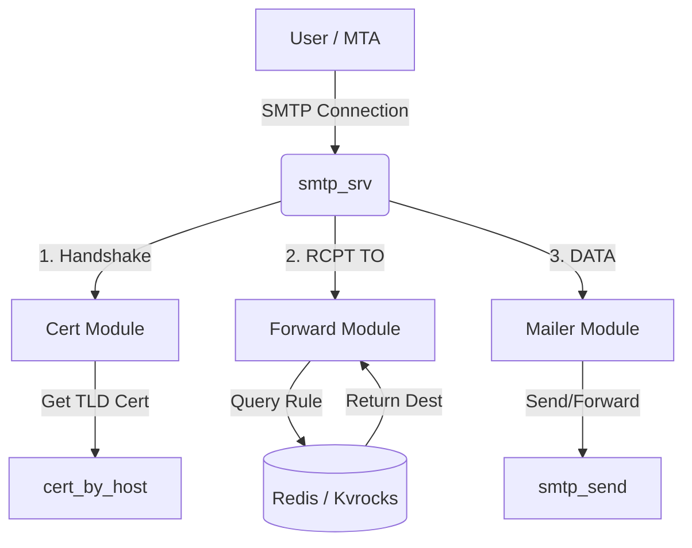

# smtp_srv : Auto-refreshing SMTPS server powered by Redis / Kvrocks

## Table of Contents
- [Introduction](#introduction)
- [Features](#features)
- [Usage](#usage)
- [Design](#design)
- [Exported API](#exported-api)
- [Tech Stack](#tech-stack)
- [Directory Structure](#directory-structure)
- [History](#history)

## Introduction
`smtp_srv` is a high-performance, asynchronous SMTPS server built with Rust. It is designed to work seamlessly with Redis or Kvrocks to manage mail forwarding rules dynamically. A key feature of this server is its ability to automatically refresh TLS certificates, ensuring secure and uninterrupted service. It serves as a robust implementations wrapper around `smtp_recv` and `smtp_send` libraries.

## Features
- **Auto-Refreshing TLS**: Automatically fetches and updates certificates based on the hostname TLD.
- **Dynamic Forwarding**: lookups forwarding rules in real-time from Redis/Kvrocks.
- **High Performance**: Built on the Tokio runtime for asynchronous I/O.
- **DKIM Support**: Integrated DKIM signing for outgoing mails.
- **Graceful Shutdown**: Handles system signals for safe termination.

## Usage

Add the dependency to `Cargo.toml`:

```toml
[dependencies]
smtp_srv = "0.2.19"
```

Entry point in `src/main.rs`:
```rust
use aok::{OK, Void};
use mimalloc::MiMalloc;

#[global_allocator]
static GLOBAL: MiMalloc = MiMalloc;

#[static_init::constructor(0)]
extern "C" fn _init() {
  log_init::init();
}

#[tokio::main]
async fn main() -> Void {
  xboot::init().await?;
  let _ = rustls::crypto::ring::default_provider().install_default();
  smtp_srv::run().await;
  OK
}
```

Run the server:
```bash
cargo run --release
```

## Design

The server operates by injecting specific implementations into the `smtp_recv` runner. The core logic handles the SMTP protocol, while `smtp_srv` provides the business logic for storage and security.

### Module Call Flow

1.  **Reception**: `smtp_recv` accepts the connection.
2.  **Certification**: `Cert` module determines the certificate to use based on the incoming host (extracts TLD).
3.  **Forwarding**: `Forward` module checks Redis for the `mailForward:<host>` key to determine the destination.
4.  **Delivery**: `Mailer` module uses `smtp_send` to dispatch the email.



## Exported API

The library exports the following main components from `src/lib.rs`:

### Functions
-   `run()`: The main async entry point. It sets up the server with `Forward`, `AuthEnv`, `Mailer`, and `Cert` implementations and waits for the shutdown signal.

### Structs
-   `Cert` (`src/cert.rs`): Implements `ssl_trait::CertByHost`. Resolves certificates by normalizing the host to its top-level domain.
-   `Forward` (`src/forward.rs`): Implements `mail_forward::Forward`. Connects to the Redis/Kvrocks backend to retrieve forwarding configurations using the `xkv` client. Supports both single-entry and batch lookups.
-   `Mailer` (`src/mailer.rs`): Implements `smtp_recv::Mailer`. Handles the final delivery of emails using the `smtp_send` library, configured with DKIM keys.

## Tech Stack

-   **Runtime**: [Tokio](https://tokio.rs/)
-   **Language**: Rust
-   **Database**: Redis / Kvrocks (via [fred](https://github.com/aweinstock314/rust-fred))
-   **TLS**: [rustls](https://github.com/rustls/rustls)
-   **Core Modules**: `smtp_recv`, `smtp_send`, `cert_by_host`

## Directory Structure

```
src/
├── cert.rs       # TLS Certificate resolution logic
├── forward.rs    # Mail forwarding rules lookup (Redis/Kvrocks)
├── lib.rs        # Library exports and run function
├── mailer.rs     # Mail sending implementation
└── main.rs       # Application entry point
```

## History

The first email was sent by Ray Tomlinson in 1971. He originally needed a way to separate the user name from the computer name, and looked down at his keyboard for a symbol that wasn't used in names. He chose the **@** symbol. The content of that first email is often forgotten, but Tomlinson recalls it was something insignificant, likely "QWERTYUIOP" or similar test characters. This simple choice of a separator fundamentally shaped the digital communication identity we use today.