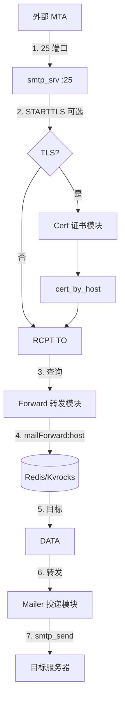
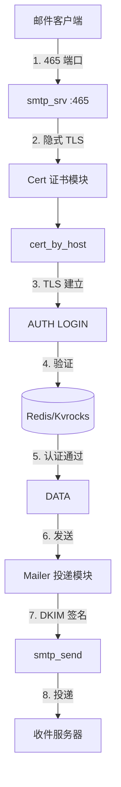

# smtp_srv : 高性能自动热更新证书的 SMTPS 服务器

## 目录
- [简介](#简介)
- [功能特性](#功能特性)
- [架构设计](#架构设计)
- [使用演示](#使用演示)
- [API 接口](#api-接口)
- [技术栈](#技术栈)
- [目录结构](#目录结构)
- [历史趣闻](#历史趣闻)

## 简介

`smtp_srv` 是基于 Rust 构建的异步 SMTPS 服务器，使用 Redis/Kvrocks 作为后端存储，专为高性能邮件处理设计。

核心能力：
- 25 端口：接收外部 MTA 邮件，按规则转发
- 465 端口：用户通过隐式 TLS 认证登录后发送邮件

服务器根据主机名 TLD 自动刷新 TLS 证书，确保服务安全且不中断。

## 功能特性

- **证书自动热更新**：根据主机名 TLD 自动获取和更新证书
- **双端口架构**：25 端口收信/转发，465 端口认证发信
- **动态转发规则**：从 Redis/Kvrocks 实时查询转发配置
- **DKIM 签名**：集成发件 DKIM 签名支持
- **优雅停机**：监听系统信号，安全终止服务
- **高吞吐量**：基于 Tokio 异步运行时

## 架构设计

### 25 端口 - 收信与转发

外部 MTA 连接 25 端口投递邮件，STARTTLS 可选。服务器从 Redis 查询转发规则后路由邮件。



### 465 端口 - 用户认证与发信

用户通过 465 端口隐式 TLS 连接，经 SMTP AUTH 认证后发送邮件。



### 转发规则查询

Redis 以 Hash 格式存储转发规则：
- Key：`mailForward:<域名>`
- Field：用户名或 `*`（通配符）
- Value：目标邮箱地址

Lua 脚本（`mailForward`、`mailForwardSet`）处理单条和批量查询，支持通配符回退。

## 使用演示

添加依赖：

```toml
[dependencies]
smtp_srv = "0.2.24"
```

入口文件：

```rust
use aok::{OK, Void};
use mimalloc::MiMalloc;

#[global_allocator]
static GLOBAL: MiMalloc = MiMalloc;

#[static_init::constructor(0)]
extern "C" fn _init() {
  log_init::init();
}

#[tokio::main]
async fn main() -> Void {
  xboot::init().await?;
  let _ = rustls::crypto::ring::default_provider().install_default();
  smtp_srv::run().await;
  OK
}
```

运行：

```bash
cargo run --release
```

发信测试（需设置环境变量 `SMTP_USER` 和 `SMTP_PASSWORD`）：

```javascript
import nodemailer from "nodemailer";

const SMTP = nodemailer.createTransport({
  host: "127.0.0.1",
  port: 465,
  secure: true,
  auth: {
    user: process.env.SMTP_USER,
    pass: process.env.SMTP_PASSWORD,
  },
  tls: {
    servername: "smtp.example.com",
  },
});

await SMTP.sendMail({
  from: '"发件人" <sender@example.com>',
  to: "recipient@example.com",
  subject: "测试",
  text: "你好",
});
```

## API 接口

### 函数

- `run()`：异步入口函数。使用 `Forward`、`AuthEnv`、`Mailer`、`Cert` 实现初始化服务器，等待停机信号。

### 数据结构

- `Cert`：实现 `ssl_trait::CertByHost`。将主机名规范化为 TLD 后解析证书。

- `Mailer`：实现 `smtp_recv::Mailer`。通过 `smtp_send` 处理邮件投递，支持 DKIM 签名。提供 `send()` 处理认证用户发信，`forward()` 处理转发邮件。

### 模块

- `r`：Redis 函数名常量（`MAIL_FORWARD`、`MAIL_FORWARD_SET`）。

## 技术栈

| 组件 | 技术 |
|------|------|
| 运行时 | [Tokio](https://tokio.rs/) |
| 编程语言 | Rust (Edition 2024) |
| 数据库 | Redis / [Kvrocks](https://kvrocks.apache.org/) |
| TLS | [rustls](https://github.com/rustls/rustls) |
| Redis 客户端 | [fred](https://github.com/aembke/fred.rs) |
| 内存分配器 | [mimalloc](https://github.com/microsoft/mimalloc) |
| 核心组件 | `smtp_recv`, `smtp_send`, `cert_by_host` |

## 目录结构

```
smtp_srv/
├── src/
│   ├── lib.rs        # 库导出，run()
│   ├── main.rs       # 应用入口
│   ├── cert.rs       # TLS 证书解析
│   ├── forward.rs    # 邮件转发逻辑
│   ├── mailer.rs     # DKIM 签名发信
│   └── r.rs          # Redis 函数常量
├── lua/
│   └── mailForward.lua  # Redis Lua 脚本
└── test/
    └── test_smtp.js     # SMTP 客户端测试
```

## 历史趣闻

电子邮件中的 `@` 符号由 Ray Tomlinson 于 1971 年选定，当时他在 ARPANET 上发送了第一封网络邮件。他需要找到能区分用户名和主机名的字符，且不会出现在人名中。看着 Model 33 电传打字机键盘，他选中了 `@` —— 当时鲜少使用的符号。那封邮件的内容可能只是 "QWERTYUIOP" 之类的测试字符。这个简单的选择成为了数字通信的通用标识。

SMTP 协议由 Jonathan Postel 在 RFC 821（1982）中正式定义。协议历经多次 RFC 演进，465 端口最初于 1997 年分配给 SMTPS，后被废弃，又在 RFC 8314（2018）中重新标准化为隐式 TLS 提交端口。
