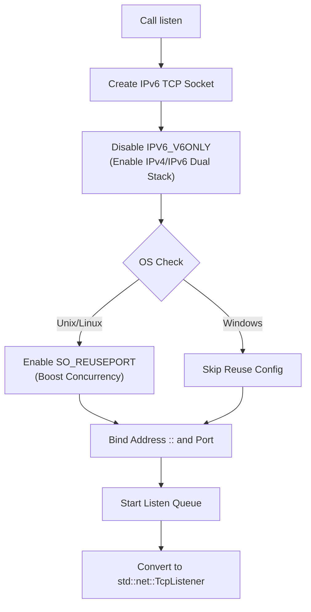
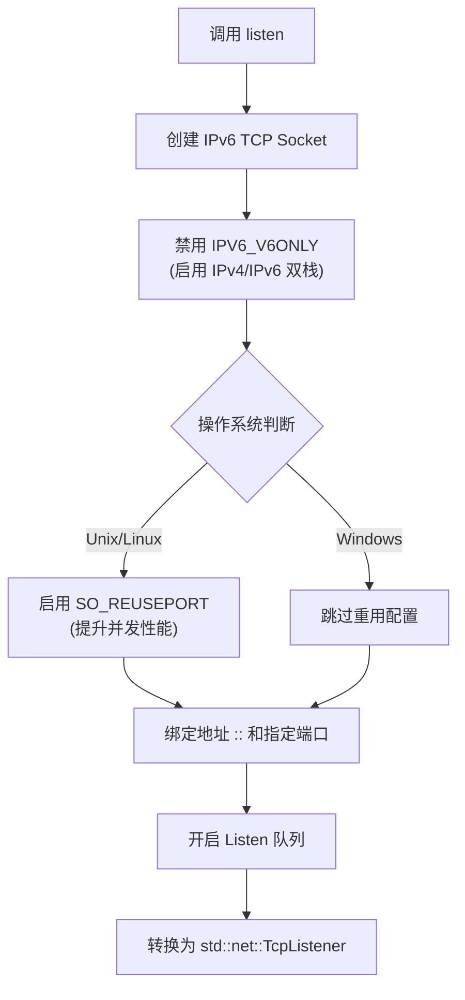

[English](#en) | [中文](#zh)

---

<a id="en"></a>

# socket_port : Minimalist Dual-Stack TCP Listener

**socket_port** provides out-of-the-box TCP port listening capabilities. By encapsulating low-level socket configurations and masking operating system differences, it enables dual-stack support (IPv4 + IPv6) and port reuse by default, effectively simplifying network programming.

## Table of Contents

- [Features](#features)
- [Usage](#usage)
- [Design Philosophy](#design-philosophy)
- [API Reference](#api-reference)
- [Tech Stack](#tech-stack)
- [Directory Structure](#directory-structure)
- [Historical Trivia](#historical-trivia)

## Features

*   **Dual-Stack Connectivity**: Handles both IPv4 and IPv6 traffic via a single socket, eliminating the need for dual binding.
*   **Port Reuse**: Automatically enables `SO_REUSEPORT` on non-Windows environments, allowing multiple processes/threads to bind to the same port for improved concurrency.
*   **Standard Compatibility**: Returns the standard `std::net::TcpListener`, ensuring seamless integration with the existing Rust ecosystem.
*   **Minimalist Interface**: Requires only the port number; all other configurations are automated.
*   **Non-blocking Mode**: Set to non-blocking by default, facilitating asynchronous programming.

## Usage

### Basic Example

```rust
use socket_port::listen;

fn main() -> std::io::Result<()> {
    // Listen on port 8080
    // Port 0 lets the OS assign an available port
    let listener = listen(8080)?;

    println!("Server listening on: {}", listener.local_addr()?);

    // Accept connections
    for stream in listener.incoming() {
        match stream {
            Ok(stream) => {
                println!("New connection: {}", stream.peer_addr()?);
            }
            Err(e) => { /* Handle error */ }
        }
    }
    Ok(())
}
```

## Design Philosophy

The library uses `socket2` for low-level socket operations, achieving dual-stack support by setting `IPV6_V6ONLY` to `false`. The workflow is as follows:



## API Reference

### `listen`

```rust
pub fn listen(port: u16) -> std::io::Result<std::net::TcpListener>
```

*   **Input**: `port` (u16) - The target listening port. Pass `0` for system-assigned random port.
*   **Output**: `Result<TcpListener>` - Returns standard library listener object on success, or IO error on failure.
*   **Behavior**:
    *   Binds to address `[::]` (IPv6 Unspecified), compatible with IPv4 mapping.
    *   Automatically disables `IPV6_V6ONLY`, enabling dual-stack support.
    *   Automatically enables `SO_REUSEPORT` on non-Windows systems.
    *   Sets to non-blocking mode.
    *   Sets listen queue length to 1024.

## Tech Stack

*   **Rust** (edition 2024)
*   **socket2**: Handles low-level system calls and socket configuration.

## Directory Structure

```
.
├── Cargo.toml          # Project configuration
├── src
│   └── lib.rs          # Core implementation (only 28 lines)
└── tests
    └── main.rs         # Comprehensive test cases
```

## Historical Trivia

### The Evolution of Port Reuse

The `SO_REUSEPORT` option is not a modern Linux invention; its roots trace back to the 4.4BSD era. It was originally designed for multicast setups, allowing multiple sockets on the same host to receive multicast packets. However, for a long time, the Linux kernel did not support this feature, until it was officially introduced in Linux 3.9 (2013).

Its introduction was primarily to solve the "Thundering Herd Problem" in high-performance network servers. Before `SO_REUSEPORT`, when multiple processes tried to `accept` on the same listening socket, a new connection arrival would wake up all waiting processes, causing a context switch storm. `SO_REUSEPORT` allows the kernel to load balance at this layer, distributing connections evenly across processes, significantly boosting throughput on modern multi-core servers. This project enables this option by default on supported systems, paying homage to this classic optimization technique.

---

## About

This project is an open-source component of [js0.site ⋅ Refactoring the Internet Plan](https://js0.site).

We are redefining the development paradigm of the Internet in a componentized way. Welcome to follow us:

* [Google Group](https://groups.google.com/g/js0-site)
* [js0site.bsky.social](https://bsky.app/profile/js0site.bsky.social)

---

<a id="zh"></a>

# socket_port : 极简双栈 TCP 监听器

**socket_port** 提供开箱即用的 TCP 端口监听能力。通过封装底层 Socket 配置，屏蔽操作系统差异，默认开启双栈支持（IPv4 + IPv6）及端口重用特性，让网络编程只需关注核心逻辑。

## 目录

- [功能特性](#功能特性)
- [使用演示](#使用演示)
- [设计思路](#设计思路)
- [API 说明](#api-说明)
- [技术堆栈](#技术堆栈)
- [目录结构](#目录结构)
- [历史趣闻](#历史趣闻)

## 功能特性

*   **双栈连接**：单 Socket 同时处理 IPv4 与 IPv6 流量，无需双路绑定。
*   **端口重用**：非 Windows 环境自动启用 `SO_REUSEPORT`，支持多进程/线程绑定同一端口，提升并发吞吐。
*   **标准兼容**：返回标准库 `std::net::TcpListener`，无缝对接现有 Rust 生态。
*   **极简接口**：仅需提供端口号，其余配置自动化完成。
*   **非阻塞模式**：默认设置为非阻塞，便于异步编程。

## 使用演示

### 基础用法

```rust
use socket_port::listen;

fn main() -> std::io::Result<()> {
    // 监听 8080 端口
    // 端口 0 表示由操作系统自动分配空闲端口
    let listener = listen(8080)?;

    println!("服务监听于: {}", listener.local_addr()?);

    // 接受连接
    for stream in listener.incoming() {
        match stream {
            Ok(stream) => {
                println!("新连接: {}", stream.peer_addr()?);
            }
            Err(e) => { /* 处理错误 */ }
        }
    }
    Ok(())
}
```

## 设计思路

采用 `socket2` 库构建底层 Socket，通过设置 `IPV6_V6ONLY` 为 `false` 实现双栈支持。流程如下：



## API 说明

### `listen`

```rust
pub fn listen(port: u16) -> std::io::Result<std::net::TcpListener>
```

*   **输入**：`port` (u16) - 目标监听端口。传 `0` 则由系统随机分配空闲端口。
*   **输出**：`Result<TcpListener>` - 绑定成功返回标准库监听器对象，失败返回 IO 错误。
*   **行为**：
    *   绑定地址为 `[::]` (IPv6 Unspecified)，兼容 IPv4 映射。
    *   自动禁用 `IPV6_V6ONLY`，启用双栈支持。
    *   非 Windows 系统自动启用 `SO_REUSEPORT`。
    *   设置为非阻塞模式。
    *   监听队列长度设为 1024。

## 技术堆栈

*   **Rust** (edition 2024)
*   **socket2**: 处理底层系统调用与 Socket 配置。

## 目录结构

```
.
├── Cargo.toml          # 项目配置
├── src
│   └── lib.rs          # 核心实现（仅 28 行）
└── tests
    └── main.rs         # 完整的测试用例
```

## 历史趣闻

### 端口复用的前世今生

`SO_REUSEPORT` 选项并非现代 Linux 独创，其历史可追溯至 4.4BSD 时代。最初设计用于多播组设置，允许同一主机上的多个 Socket 接收组播数据包。然而，在很长一段时间内，Linux 内核并未支持此特性，直到 Linux 3.9 (2013 年) 才正式引入。

它的引入主要是为了解决高性能网络服务器中的"惊群效应" (Thundering Herd Problem)。在没有 `SO_REUSEPORT` 之前，多个进程尝试 `accept` 同一个监听 Socket 时，新连接到达会唤醒所有等待进程，导致上下文切换风暴。`SO_REUSEPORT` 允许内核在该层级进行负载均衡，将连接均匀分发给不同进程，显著提升了现代多核服务器的吞吐性能。本项目在支持的系统上默认开启此选项，正是向这一经典优化技术致敬。

---

## 关于

本项目为 [js0.site ⋅ 重构互联网计划](https://js0.site) 的开源组件。

我们正在以组件化的方式重新定义互联网的开发范式，欢迎关注：

* [谷歌邮件列表](https://groups.google.com/g/js0-site)
* [js0site.bsky.social](https://bsky.app/profile/js0site.bsky.social)
