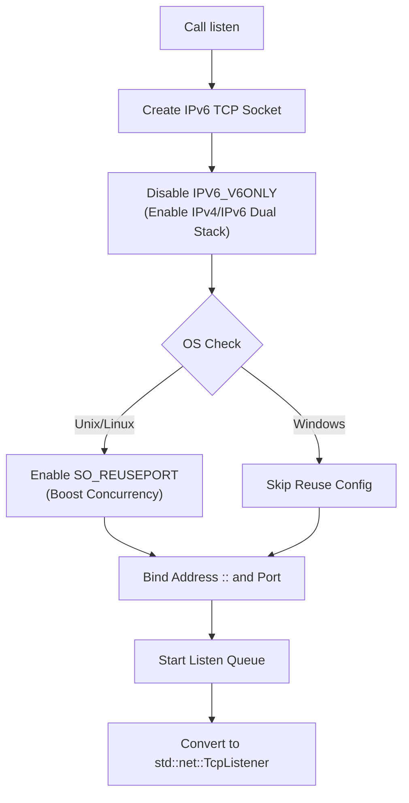

# socket_port : Minimalist Dual-Stack TCP Listener

**socket_port** provides out-of-the-box TCP port listening capabilities. By encapsulating low-level socket configurations and masking operating system differences, it enables dual-stack support (IPv4 + IPv6) and port reuse by default, effectively simplifying network programming.

## Table of Contents

- [Features](#features)
- [Usage](#usage)
- [Design Philosophy](#design-philosophy)
- [API Reference](#api-reference)
- [Tech Stack](#tech-stack)
- [Directory Structure](#directory-structure)
- [Historical Trivia](#historical-trivia)

## Features

*   **Dual-Stack Connectivity**: Handles both IPv4 and IPv6 traffic via a single socket, eliminating the need for dual binding.
*   **Port Reuse**: Automatically enables `SO_REUSEPORT` on non-Windows environments, allowing multiple processes/threads to bind to the same port for improved concurrency.
*   **Standard Compatibility**: Returns the standard `std::net::TcpListener`, ensuring seamless integration with the existing Rust ecosystem.
*   **Minimalist Interface**: Requires only the port number; all other configurations are automated.
*   **Non-blocking Mode**: Set to non-blocking by default, facilitating asynchronous programming.

## Usage

### Basic Example

```rust
use socket_port::listen;

fn main() -> std::io::Result<()> {
    // Listen on port 8080
    // Port 0 lets the OS assign an available port
    let listener = listen(8080)?;

    println!("Server listening on: {}", listener.local_addr()?);

    // Accept connections
    for stream in listener.incoming() {
        match stream {
            Ok(stream) => {
                println!("New connection: {}", stream.peer_addr()?);
            }
            Err(e) => { /* Handle error */ }
        }
    }
    Ok(())
}
```

## Design Philosophy

The library uses `socket2` for low-level socket operations, achieving dual-stack support by setting `IPV6_V6ONLY` to `false`. The workflow is as follows:



## API Reference

### `listen`

```rust
pub fn listen(port: u16) -> std::io::Result<std::net::TcpListener>
```

*   **Input**: `port` (u16) - The target listening port. Pass `0` for system-assigned random port.
*   **Output**: `Result<TcpListener>` - Returns standard library listener object on success, or IO error on failure.
*   **Behavior**:
    *   Binds to address `[::]` (IPv6 Unspecified), compatible with IPv4 mapping.
    *   Automatically disables `IPV6_V6ONLY`, enabling dual-stack support.
    *   Automatically enables `SO_REUSEPORT` on non-Windows systems.
    *   Sets to non-blocking mode.
    *   Sets listen queue length to 1024.

## Tech Stack

*   **Rust** (edition 2024)
*   **socket2**: Handles low-level system calls and socket configuration.

## Directory Structure

```
.
├── Cargo.toml          # Project configuration
├── src
│   └── lib.rs          # Core implementation (only 28 lines)
└── tests
    └── main.rs         # Comprehensive test cases
```

## Historical Trivia

### The Evolution of Port Reuse

The `SO_REUSEPORT` option is not a modern Linux invention; its roots trace back to the 4.4BSD era. It was originally designed for multicast setups, allowing multiple sockets on the same host to receive multicast packets. However, for a long time, the Linux kernel did not support this feature, until it was officially introduced in Linux 3.9 (2013).

Its introduction was primarily to solve the "Thundering Herd Problem" in high-performance network servers. Before `SO_REUSEPORT`, when multiple processes tried to `accept` on the same listening socket, a new connection arrival would wake up all waiting processes, causing a context switch storm. `SO_REUSEPORT` allows the kernel to load balance at this layer, distributing connections evenly across processes, significantly boosting throughput on modern multi-core servers. This project enables this option by default on supported systems, paying homage to this classic optimization technique.