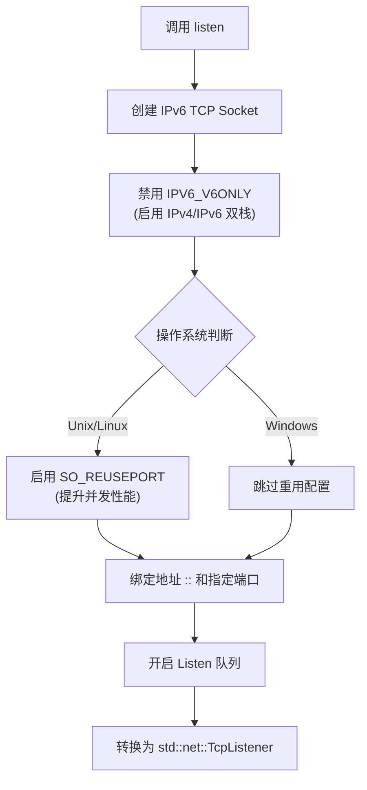

# socket_port : 极简双栈 TCP 监听器

**socket_port** 提供开箱即用的 TCP 端口监听能力。通过封装底层 Socket 配置，屏蔽操作系统差异，默认开启双栈支持（IPv4 + IPv6）及端口重用特性，让网络编程只需关注核心逻辑。

## 目录

- [功能特性](#功能特性)
- [使用演示](#使用演示)
- [设计思路](#设计思路)
- [API 说明](#api-说明)
- [技术堆栈](#技术堆栈)
- [目录结构](#目录结构)
- [历史趣闻](#历史趣闻)

## 功能特性

*   **双栈连接**：单 Socket 同时处理 IPv4 与 IPv6 流量，无需双路绑定。
*   **端口重用**：非 Windows 环境自动启用 `SO_REUSEPORT`，支持多进程/线程绑定同一端口，提升并发吞吐。
*   **标准兼容**：返回标准库 `std::net::TcpListener`，无缝对接现有 Rust 生态。
*   **极简接口**：仅需提供端口号，其余配置自动化完成。
*   **非阻塞模式**：默认设置为非阻塞，便于异步编程。

## 使用演示

### 基础用法

```rust
use socket_port::listen;

fn main() -> std::io::Result<()> {
    // 监听 8080 端口
    // 端口 0 表示由操作系统自动分配空闲端口
    let listener = listen(8080)?;

    println!("服务监听于: {}", listener.local_addr()?);

    // 接受连接
    for stream in listener.incoming() {
        match stream {
            Ok(stream) => {
                println!("新连接: {}", stream.peer_addr()?);
            }
            Err(e) => { /* 处理错误 */ }
        }
    }
    Ok(())
}
```

## 设计思路

采用 `socket2` 库构建底层 Socket，通过设置 `IPV6_V6ONLY` 为 `false` 实现双栈支持。流程如下：



## API 说明

### `listen`

```rust
pub fn listen(port: u16) -> std::io::Result<std::net::TcpListener>
```

*   **输入**：`port` (u16) - 目标监听端口。传 `0` 则由系统随机分配空闲端口。
*   **输出**：`Result<TcpListener>` - 绑定成功返回标准库监听器对象，失败返回 IO 错误。
*   **行为**：
    *   绑定地址为 `[::]` (IPv6 Unspecified)，兼容 IPv4 映射。
    *   自动禁用 `IPV6_V6ONLY`，启用双栈支持。
    *   非 Windows 系统自动启用 `SO_REUSEPORT`。
    *   设置为非阻塞模式。
    *   监听队列长度设为 1024。

## 技术堆栈

*   **Rust** (edition 2024)
*   **socket2**: 处理底层系统调用与 Socket 配置。

## 目录结构

```
.
├── Cargo.toml          # 项目配置
├── src
│   └── lib.rs          # 核心实现（仅 28 行）
└── tests
    └── main.rs         # 完整的测试用例
```

## 历史趣闻

### 端口复用的前世今生

`SO_REUSEPORT` 选项并非现代 Linux 独创，其历史可追溯至 4.4BSD 时代。最初设计用于多播组设置，允许同一主机上的多个 Socket 接收组播数据包。然而，在很长一段时间内，Linux 内核并未支持此特性，直到 Linux 3.9 (2013 年) 才正式引入。

它的引入主要是为了解决高性能网络服务器中的"惊群效应" (Thundering Herd Problem)。在没有 `SO_REUSEPORT` 之前，多个进程尝试 `accept` 同一个监听 Socket 时，新连接到达会唤醒所有等待进程，导致上下文切换风暴。`SO_REUSEPORT` 允许内核在该层级进行负载均衡，将连接均匀分发给不同进程，显著提升了现代多核服务器的吞吐性能。本项目在支持的系统上默认开启此选项，正是向这一经典优化技术致敬。