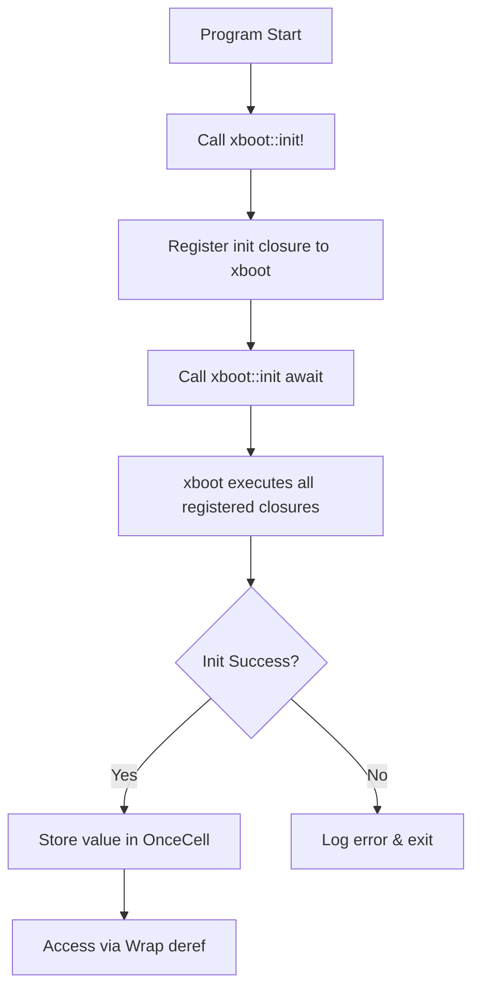
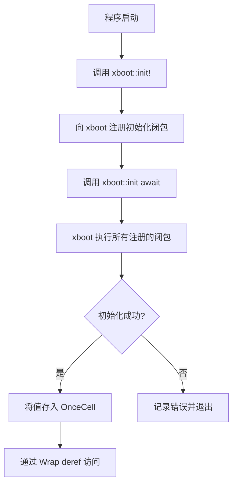

[English](#en) | [中文](#zh)

---

<a id="en"></a>

# static\_ : Async Global Static Initialization Made Simple

A Rust library for initializing global static variables asynchronously before program startup.

## Table of Contents

- [Features](#features)
- [Installation](#installation)
- [Usage](#usage)
- [API Reference](#api-reference)
- [Design](#design)
- [Tech Stack](#tech-stack)
- [Project Structure](#project-structure)
- [History](#history)
- [License](#license)

## Features

- Declarative macro for async static initialization
- Automatic error handling with logging
- Thread-safe access via `OnceCell` wrapper
- Seamless integration with tokio runtime
- Zero-cost abstraction after initialization

## Installation

Add to `Cargo.toml`:

```toml
[dependencies]
static_ = "0.1"
```

## Usage

```rust
use aok::Result;

// Database connection pool
struct DbPool {
  conn: String,
}

impl DbPool {
  async fn connect(url: &str) -> Result<Self> {
    // Simulate async connection
    Ok(Self { conn: url.to_string() })
  }

  async fn query(&self, sql: &str) -> Result<()> {
    println!("[{}] {}", self.conn, sql);
    Ok(())
  }
}

// Declare async-initialized static variable
xboot::init!(DB: DbPool async {
  DbPool::connect("postgres://localhost/mydb").await
});

#[tokio::main]
async fn main() -> Result<()> {
  // Initialize all registered statics
  xboot::init().await?;

  // Access like regular static
  DB.query("SELECT * FROM users").await?;
  Ok(())
}
```

## API Reference

### Macro `init!`

```rust
xboot::init!($var:ident: $type:ident $init:expr)
```

Declares global static variable with async initialization.

Parameters:

- `$var` - Static variable name
- `$type` - Type of the value
- `$init` - Async expression returning `Result<$type>`

On initialization failure, logs error and exits with code 1.

### Re-exports

| Item          | Description                                               |
| ------------- | --------------------------------------------------------- |
| `OnceCell`    | Thread-safe cell for one-time initialization              |
| `Wrap<T>`     | Deref wrapper for `OnceCell`, enables direct field access |
| `xboot::init` | Async function to trigger all registered initializations  |
| `log`         | Logging facade for error output                           |

### `Wrap<T>`

```rust
pub struct Wrap<T: 'static>(pub &'static OnceCell<T>);
```

Implements `Deref<Target = T>`, allowing transparent access to inner value.

## Design



The initialization flow:

1. `init!` macro creates `OnceCell` and `Wrap` wrapper
2. Registers async init closure with `xboot::add!`
3. `xboot::init().await` triggers `xboot::init()`
4. xboot executes all registered async closures concurrently
5. Results stored in respective `OnceCell` instances
6. `Wrap` provides transparent `Deref` access

## Tech Stack

| Crate                                    | Purpose                            |
| ---------------------------------------- | ---------------------------------- |
| [xboot](https://docs.rs/xboot)           | Async initialization orchestration |
| [async_wrap](https://docs.rs/async_wrap) | `OnceCell` and `Wrap` types        |
| [tokio](https://tokio.rs)                | Async runtime                      |
| [log](https://docs.rs/log)               | Error logging                      |
| [aok](https://docs.rs/aok)               | Result type utilities              |

## Project Structure

```
static_/
├── Cargo.toml      # Package manifest
├── src/
│   └── lib.rs      # Core macro and re-exports
├── tests/
│   └── main.rs     # Integration tests
└── readme/
    ├── en.md       # English documentation
    └── zh.md       # Chinese documentation
```

## History

The challenge of initializing global static variables in Rust has evolved significantly over the years.

`lazy_static` emerged in November 2014, predating Rust 1.0 by five months. It introduced macro-based lazy initialization but came with limitations: confusing error messages due to generated types, and potential issues with spinlock behavior when certain features were enabled.

`once_cell` arrived in August 2018, offering macro-free alternatives with `OnceCell` and `Lazy` types. Its cleaner API and better IDE support made it the preferred choice for many projects.

Rust 1.70 (2023) stabilized `std::sync::OnceLock`, and Rust 1.80 (2024) added `std::sync::LazyLock`, bringing core lazy initialization into the standard library.

However, all these solutions share a limitation: they block threads during initialization races. In async contexts, this can stall the executor. `static_` addresses this by leveraging `xboot` to orchestrate async initialization before the main program logic runs, ensuring all statics are ready without blocking async runtimes.

## License

[MulanPSL-2.0](https://opensource.org/licenses/MulanPSL-2.0)

---

## About

This project is an open-source component of [js0.site ⋅ Refactoring the Internet Plan](https://js0.site).

We are redefining the development paradigm of the Internet in a componentized way. Welcome to follow us:

- [Google Group](https://groups.google.com/g/js0-site)
- [js0site.bsky.social](https://bsky.app/profile/js0site.bsky.social)

---

<a id="zh"></a>

# static\_ : 异步全局静态变量初始化

Rust 库，用于在程序启动前异步初始化全局静态变量。

## 目录

- [特性](#特性)
- [安装](#安装)
- [使用](#使用)
- [API 参考](#api-参考)
- [设计思路](#设计思路)
- [技术栈](#技术栈)
- [目录结构](#目录结构)
- [历史](#历史)
- [许可证](#许可证)

## 特性

- 声明式宏实现异步静态初始化
- 自动错误处理与日志记录
- 基于 `OnceCell` 的线程安全访问
- 无缝集成 tokio 运行时
- 初始化后零开销抽象

## 安装

添加到 `Cargo.toml`:

```toml
[dependencies]
static_ = "0.1"
```

## 使用

```rust
use aok::Result;

// 数据库连接池
struct DbPool {
  conn: String,
}

impl DbPool {
  async fn connect(url: &str) -> Result<Self> {
    // 模拟异步连接
    Ok(Self { conn: url.to_string() })
  }

  async fn query(&self, sql: &str) -> Result<()> {
    println!("[{}] {}", self.conn, sql);
    Ok(())
  }
}

// 声明异步初始化的静态变量
xboot::init!(DB: DbPool async {
  DbPool::connect("postgres://localhost/mydb").await
});

#[tokio::main]
async fn main() -> Result<()> {
  // 初始化所有注册的静态变量
  xboot::init().await?;

  // 像普通静态变量一样访问
  DB.query("SELECT * FROM users").await?;
  Ok(())
}
```

## API 参考

### 宏 `init!`

```rust
xboot::init!($var:ident: $type:ident $init:expr)
```

声明带异步初始化的全局静态变量。

参数:

- `$var` - 静态变量名
- `$type` - 值类型
- `$init` - 返回 `Result<$type>` 的异步表达式

初始化失败时，记录错误日志并以退出码 1 终止程序。

### 重导出

| 项            | 说明                                         |
| ------------- | -------------------------------------------- |
| `OnceCell`    | 线程安全的单次初始化单元                     |
| `Wrap<T>`     | `OnceCell` 的 Deref 包装器，支持直接字段访问 |
| `xboot::init` | 触发所有注册初始化的异步函数                 |
| `log`         | 错误输出的日志门面                           |

### `Wrap<T>`

```rust
pub struct Wrap<T: 'static>(pub &'static OnceCell<T>);
```

实现 `Deref<Target = T>`，允许透明访问内部值。

## 设计思路



初始化流程:

1. `init!` 宏创建 `OnceCell` 和 `Wrap` 包装器
2. 通过 `xboot::add!` 注册异步初始化闭包
3. `xboot::init().await` 触发 `xboot::init()`
4. xboot 并发执行所有注册的异步闭包
5. 结果存入对应的 `OnceCell` 实例
6. `Wrap` 提供透明的 `Deref` 访问

## 技术栈

| Crate                                    | 用途                      |
| ---------------------------------------- | ------------------------- |
| [xboot](https://docs.rs/xboot)           | 异步初始化编排            |
| [async_wrap](https://docs.rs/async_wrap) | `OnceCell` 和 `Wrap` 类型 |
| [tokio](https://tokio.rs)                | 异步运行时                |
| [log](https://docs.rs/log)               | 错误日志                  |
| [aok](https://docs.rs/aok)               | Result 类型工具           |

## 目录结构

```
static_/
├── Cargo.toml      # 包清单
├── src/
│   └── lib.rs      # 核心宏和重导出
├── tests/
│   └── main.rs     # 集成测试
└── readme/
    ├── en.md       # 英文文档
    └── zh.md       # 中文文档
```

## 历史

Rust 中全局静态变量初始化的挑战经历了显著演变。

`lazy_static` 于 2014 年 11 月发布，比 Rust 1.0 早五个月。它引入了基于宏的惰性初始化，但存在局限：生成的类型导致错误信息混乱，启用某些特性时可能出现自旋锁问题。

`once_cell` 于 2018 年 8 月问世，提供无宏的 `OnceCell` 和 `Lazy` 类型。更清晰的 API 和更好的 IDE 支持使其成为众多项目的首选。

Rust 1.70 (2023) 稳定了 `std::sync::OnceLock`，Rust 1.80 (2024) 添加了 `std::sync::LazyLock`，将核心惰性初始化纳入标准库。

然而，这些方案都有共同局限：初始化竞争时会阻塞线程。在异步上下文中，这可能导致执行器停滞。`static_` 通过利用 `xboot` 在主程序逻辑运行前编排异步初始化来解决此问题，确保所有静态变量就绪而不阻塞异步运行时。

## 许可证

[MulanPSL-2.0](https://opensource.org/licenses/MulanPSL-2.0)

---

## 关于

本项目为 [js0.site ⋅ 重构互联网计划](https://js0.site) 的开源组件。

我们正在以组件化的方式重新定义互联网的开发范式，欢迎关注：

- [谷歌邮件列表](https://groups.google.com/g/js0-site)
- [js0site.bsky.social](https://bsky.app/profile/js0site.bsky.social)
