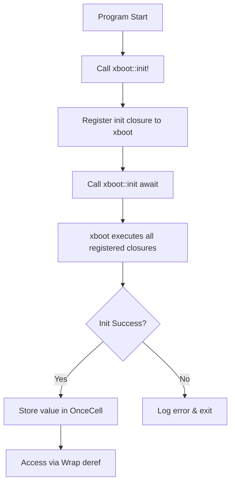

# static_ : Async Global Static Initialization Made Simple

A Rust library for initializing global static variables asynchronously before program startup.

## Table of Contents

- [Features](#features)
- [Installation](#installation)
- [Usage](#usage)
- [API Reference](#api-reference)
- [Design](#design)
- [Tech Stack](#tech-stack)
- [Project Structure](#project-structure)
- [History](#history)
- [License](#license)

## Features

- Declarative macro for async static initialization
- Automatic error handling with logging
- Thread-safe access via `OnceCell` wrapper
- Seamless integration with tokio runtime
- Zero-cost abstraction after initialization

## Installation

Add to `Cargo.toml`:

```toml
[dependencies]
static_ = "0.1"
```

## Usage

```rust
use aok::Result;

// Database connection pool
struct DbPool {
  conn: String,
}

impl DbPool {
  async fn connect(url: &str) -> Result<Self> {
    // Simulate async connection
    Ok(Self { conn: url.to_string() })
  }

  async fn query(&self, sql: &str) -> Result<()> {
    println!("[{}] {}", self.conn, sql);
    Ok(())
  }
}

// Declare async-initialized static variable
xboot::init!(DB: DbPool async {
  DbPool::connect("postgres://localhost/mydb").await
});

#[tokio::main]
async fn main() -> Result<()> {
  // Initialize all registered statics
  xboot::init().await?;

  // Access like regular static
  DB.query("SELECT * FROM users").await?;
  Ok(())
}
```

## API Reference

### Macro `init!`

```rust
xboot::init!($var:ident: $type:ident $init:expr)
```

Declares global static variable with async initialization.

Parameters:
- `$var` - Static variable name
- `$type` - Type of the value
- `$init` - Async expression returning `Result<$type>`

On initialization failure, logs error and exits with code 1.

### Re-exports

| Item | Description |
|------|-------------|
| `OnceCell` | Thread-safe cell for one-time initialization |
| `Wrap<T>` | Deref wrapper for `OnceCell`, enables direct field access |
| `xboot::init` | Async function to trigger all registered initializations |
| `log` | Logging facade for error output |

### `Wrap<T>`

```rust
pub struct Wrap<T: 'static>(pub &'static OnceCell<T>);
```

Implements `Deref<Target = T>`, allowing transparent access to inner value.

## Design



The initialization flow:

1. `init!` macro creates `OnceCell` and `Wrap` wrapper
2. Registers async init closure with `xboot::add!`
3. `xboot::init().await` triggers `xboot::init()`
4. xboot executes all registered async closures concurrently
5. Results stored in respective `OnceCell` instances
6. `Wrap` provides transparent `Deref` access

## Tech Stack

| Crate | Purpose |
|-------|---------|
| [xboot](https://docs.rs/xboot) | Async initialization orchestration |
| [async_wrap](https://docs.rs/async_wrap) | `OnceCell` and `Wrap` types |
| [tokio](https://tokio.rs) | Async runtime |
| [log](https://docs.rs/log) | Error logging |
| [aok](https://docs.rs/aok) | Result type utilities |

## Project Structure

```
static_/
├── Cargo.toml      # Package manifest
├── src/
│   └── lib.rs      # Core macro and re-exports
├── tests/
│   └── main.rs     # Integration tests
└── readme/
    ├── en.md       # English documentation
    └── zh.md       # Chinese documentation
```

## History

The challenge of initializing global static variables in Rust has evolved significantly over the years.

`lazy_static` emerged in November 2014, predating Rust 1.0 by five months. It introduced macro-based lazy initialization but came with limitations: confusing error messages due to generated types, and potential issues with spinlock behavior when certain features were enabled.

`once_cell` arrived in August 2018, offering macro-free alternatives with `OnceCell` and `Lazy` types. Its cleaner API and better IDE support made it the preferred choice for many projects.

Rust 1.70 (2023) stabilized `std::sync::OnceLock`, and Rust 1.80 (2024) added `std::sync::LazyLock`, bringing core lazy initialization into the standard library.

However, all these solutions share a limitation: they block threads during initialization races. In async contexts, this can stall the executor. `static_` addresses this by leveraging `xboot` to orchestrate async initialization before the main program logic runs, ensuring all statics are ready without blocking async runtimes.

## License

[MulanPSL-2.0](https://opensource.org/licenses/MulanPSL-2.0)
