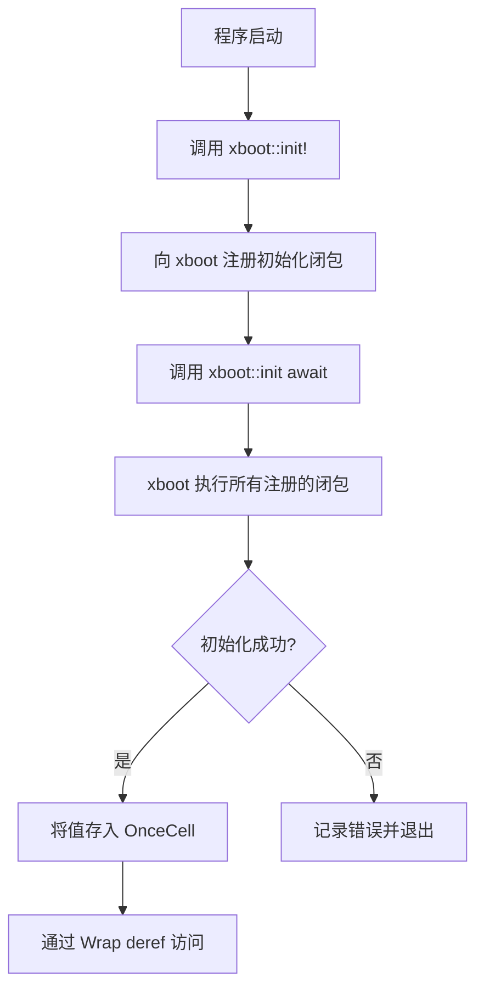

# static\_ : 异步全局静态变量初始化

Rust 库，用于在程序启动前异步初始化全局静态变量。

## 目录

- [特性](#特性)
- [安装](#安装)
- [使用](#使用)
- [API 参考](#api-参考)
- [设计思路](#设计思路)
- [技术栈](#技术栈)
- [目录结构](#目录结构)
- [历史](#历史)
- [许可证](#许可证)

## 特性

- 声明式宏实现异步静态初始化
- 自动错误处理与日志记录
- 基于 `OnceCell` 的线程安全访问
- 无缝集成 tokio 运行时
- 初始化后零开销抽象

## 安装

添加到 `Cargo.toml`:

```toml
[dependencies]
static_ = "0.1"
```

## 使用

```rust
use aok::Result;

// 数据库连接池
struct DbPool {
  conn: String,
}

impl DbPool {
  async fn connect(url: &str) -> Result<Self> {
    // 模拟异步连接
    Ok(Self { conn: url.to_string() })
  }

  async fn query(&self, sql: &str) -> Result<()> {
    println!("[{}] {}", self.conn, sql);
    Ok(())
  }
}

// 声明异步初始化的静态变量
xboot::init!(DB: DbPool async {
  DbPool::connect("postgres://localhost/mydb").await
});

#[tokio::main]
async fn main() -> Result<()> {
  // 初始化所有注册的静态变量
  xboot::init().await?;

  // 像普通静态变量一样访问
  DB.query("SELECT * FROM users").await?;
  Ok(())
}
```

## API 参考

### 宏 `init!`

```rust
xboot::init!($var:ident: $type:ident $init:expr)
```

声明带异步初始化的全局静态变量。

参数:

- `$var` - 静态变量名
- `$type` - 值类型
- `$init` - 返回 `Result<$type>` 的异步表达式

初始化失败时，记录错误日志并以退出码 1 终止程序。

### 重导出

| 项            | 说明                                         |
| ------------- | -------------------------------------------- |
| `OnceCell`    | 线程安全的单次初始化单元                     |
| `Wrap<T>`     | `OnceCell` 的 Deref 包装器，支持直接字段访问 |
| `xboot::init` | 触发所有注册初始化的异步函数                 |
| `log`         | 错误输出的日志门面                           |

### `Wrap<T>`

```rust
pub struct Wrap<T: 'static>(pub &'static OnceCell<T>);
```

实现 `Deref<Target = T>`，允许透明访问内部值。

## 设计思路



初始化流程:

1. `init!` 宏创建 `OnceCell` 和 `Wrap` 包装器
2. 通过 `xboot::add!` 注册异步初始化闭包
3. `xboot::init().await` 触发 `xboot::init()`
4. xboot 并发执行所有注册的异步闭包
5. 结果存入对应的 `OnceCell` 实例
6. `Wrap` 提供透明的 `Deref` 访问

## 技术栈

| Crate                                    | 用途                      |
| ---------------------------------------- | ------------------------- |
| [xboot](https://docs.rs/xboot)           | 异步初始化编排            |
| [async_wrap](https://docs.rs/async_wrap) | `OnceCell` 和 `Wrap` 类型 |
| [tokio](https://tokio.rs)                | 异步运行时                |
| [log](https://docs.rs/log)               | 错误日志                  |
| [aok](https://docs.rs/aok)               | Result 类型工具           |

## 目录结构

```
static_/
├── Cargo.toml      # 包清单
├── src/
│   └── lib.rs      # 核心宏和重导出
├── tests/
│   └── main.rs     # 集成测试
└── readme/
    ├── en.md       # 英文文档
    └── zh.md       # 中文文档
```

## 历史

Rust 中全局静态变量初始化的挑战经历了显著演变。

`lazy_static` 于 2014 年 11 月发布，比 Rust 1.0 早五个月。它引入了基于宏的惰性初始化，但存在局限：生成的类型导致错误信息混乱，启用某些特性时可能出现自旋锁问题。

`once_cell` 于 2018 年 8 月问世，提供无宏的 `OnceCell` 和 `Lazy` 类型。更清晰的 API 和更好的 IDE 支持使其成为众多项目的首选。

Rust 1.70 (2023) 稳定了 `std::sync::OnceLock`，Rust 1.80 (2024) 添加了 `std::sync::LazyLock`，将核心惰性初始化纳入标准库。

然而，这些方案都有共同局限：初始化竞争时会阻塞线程。在异步上下文中，这可能导致执行器停滞。`static_` 通过利用 `xboot` 在主程序逻辑运行前编排异步初始化来解决此问题，确保所有静态变量就绪而不阻塞异步运行时。

## 许可证

[MulanPSL-2.0](https://opensource.org/licenses/MulanPSL-2.0)
