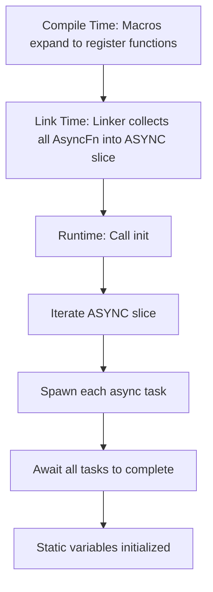
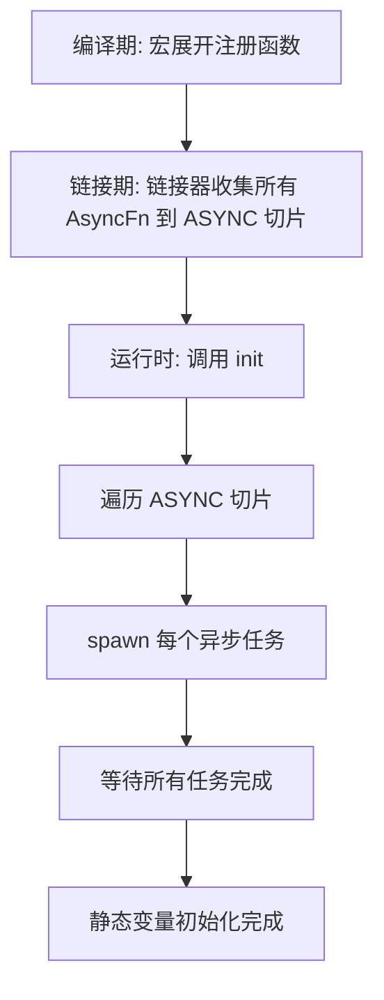

[English](#en) | [中文](#zh)

---

<a id="en"></a>

# xboot : Async Static Initialization Before Main

Pair with [static_](https://crates.io/crates/static_) for simplified usage.

## Table of Contents

- [Introduction](#introduction)
- [Features](#features)
- [Installation](#installation)
- [Usage](#usage)
- [Design](#design)
- [Tech Stack](#tech-stack)
- [Project Structure](#project-structure)
- [API Reference](#api-reference)
- [History](#history)

## Introduction

xboot enables async initialization of static variables before program execution begins. Built on [linkme](https://github.com/dtolnay/linkme)'s distributed slice mechanism, it collects async initialization functions at compile time and executes them at runtime startup.

Typical use cases include establishing database connections, initializing Redis clients, or setting up other resources that require async operations as module-level static variables.

## Features

- Async static variable initialization
- Zero-cost compile-time collection via linker sections
- Cross-platform support (Linux, macOS, Windows)
- Simple macro-based API
- Compatible with tokio runtime

## Installation

Add to your `Cargo.toml`:

```toml
[dependencies]
xboot = "0.1"
```

## Usage

```rust
use aok::{OK, Result};
use tokio::time::{Duration, sleep};
use log::info;

pub struct Client {}

impl Client {
  pub async fn test(&self) {
    info!("client test success");
  }
}

pub async fn connect() -> Result<Client> {
  info!("Sleeping for 3 seconds...");
  sleep(Duration::from_secs(3)).await;
  Ok(Client {})
}

// Register async initialization
static_::init!(CLIENT: Client {
  connect().await
});

#[tokio::main]
async fn main() -> Result<()> {
  // Execute all registered initializations
  static_::init().await?;
  info!("inited");
  CLIENT.test().await;
  OK
}
```

## Design

xboot leverages linkme's distributed slice to collect initialization functions across the crate dependency graph at link time.

### Initialization Flow



### Core Components

1. `ASYNC` - Distributed slice storing all async initialization functions
2. `AsyncFn` - Type alias for functions returning `JoinHandle<Result<()>>`
3. `init()` - Iterates and awaits all registered initialization tasks
4. `add!` - Macro to register initialization expressions

### How It Works

The `add!` macro:
1. Generates unique function name using `gensym`
2. Wraps async initialization in `tokio::task::spawn`
3. Registers function pointer to `ASYNC` distributed slice via `#[distributed_slice]`

At runtime, `init()` iterates through `ASYNC` and awaits each spawned task sequentially.

## Tech Stack

| Crate | Purpose |
|-------|---------|
| [linkme](https://crates.io/crates/linkme) | Distributed slice for compile-time collection |
| [tokio](https://crates.io/crates/tokio) | Async runtime and task spawning |
| [paste](https://crates.io/crates/paste) | Macro identifier concatenation |
| [gensym](https://crates.io/crates/gensym) | Unique symbol generation |
| [aok](https://crates.io/crates/aok) | Result type utilities |

## Project Structure

```
xboot/
├── Cargo.toml
├── src/
│   └── lib.rs      # Core implementation
└── tests/
    ├── Cargo.toml
    └── src/
        └── main.rs # Usage example
```

## API Reference

### Types

| Type | Description |
|------|-------------|
| `Task` | `tokio::task::JoinHandle<Result<()>>` |
| `AsyncFn` | `fn() -> Task` |
| `ASYNC` | `[AsyncFn]` distributed slice |

### Functions

| Function | Description |
|----------|-------------|
| `init() -> Result<()>` | Execute all registered async initializations |

### Macros

| Macro | Description |
|-------|-------------|
| `add!(expr)` | Register async initialization expression |

### Re-exports

- `gensym::gensym`
- `linkme::distributed_slice`
- `paste::paste`
- `tokio`

## History

The challenge of static variable initialization has deep roots in systems programming. In C++, the "static initialization order fiasco" has plagued developers since the language's early days—when static variables across translation units depend on each other, their initialization order is undefined, leading to subtle bugs.

The ELF binary format addressed part of this through `.init` and `.ctors` sections, allowing constructors to run before `main()`. However, this "life before main" approach conflicts with Rust's safety guarantees and doesn't support async operations.

David Tolnay's [linkme](https://github.com/dtolnay/linkme) crate brought a elegant solution: using `link_section` attributes to collect static elements into contiguous binary sections at link time, without runtime initialization overhead. This zero-cost abstraction operates entirely during compilation and linking.

xboot builds upon linkme to extend this pattern into the async world, enabling modern Rust applications to initialize resources like database connections before the main logic begins—combining the convenience of global state with the safety of explicit initialization.

---

## About

This project is an open-source component of [js0.site ⋅ Refactoring the Internet Plan](https://js0.site).

We are redefining the development paradigm of the Internet in a componentized way. Welcome to follow us:

* [Google Group](https://groups.google.com/g/js0-site)
* [js0site.bsky.social](https://bsky.app/profile/js0site.bsky.social)

---

<a id="zh"></a>

# xboot : 主函数前异步初始化静态变量

配合 [static_](https://crates.io/crates/static_) 简化使用。

## 目录

- [简介](#简介)
- [特性](#特性)
- [安装](#安装)
- [使用](#使用)
- [设计](#设计)
- [技术栈](#技术栈)
- [项目结构](#项目结构)
- [API 参考](#api-参考)
- [历史](#历史)

## 简介

xboot 支持在程序启动前异步初始化静态变量。基于 [linkme](https://github.com/dtolnay/linkme) 的分布式切片机制，在编译期收集异步初始化函数，运行时启动阶段执行。

典型场景：将数据库连接、Redis 客户端等需要异步操作的资源设置为模块级静态变量。

## 特性

- 异步静态变量初始化
- 零开销编译期收集（通过链接器段）
- 跨平台支持（Linux、macOS、Windows）
- 简洁的宏 API
- 兼容 tokio 运行时

## 安装

在 `Cargo.toml` 中添加：

```toml
[dependencies]
xboot = "0.1"
```

## 使用

```rust
use aok::{OK, Result};
use tokio::time::{Duration, sleep};
use log::info;

pub struct Client {}

impl Client {
  pub async fn test(&self) {
    info!("client test success");
  }
}

pub async fn connect() -> Result<Client> {
  info!("Sleeping for 3 seconds...");
  sleep(Duration::from_secs(3)).await;
  Ok(Client {})
}

// 注册异步初始化
static_::init!(CLIENT: Client {
  connect().await
});

#[tokio::main]
async fn main() -> Result<()> {
  // 执行所有注册的初始化
  static_::init().await?;
  info!("inited");
  CLIENT.test().await;
  OK
}
```

## 设计

xboot 利用 linkme 的分布式切片，在链接期跨 crate 依赖图收集初始化函数。

### 初始化流程



### 核心组件

1. `ASYNC` - 存储所有异步初始化函数的分布式切片
2. `AsyncFn` - 返回 `JoinHandle<Result<()>>` 的函数类型别名
3. `init()` - 遍历并等待所有注册的初始化任务
4. `add!` - 注册初始化表达式的宏

### 工作原理

`add!` 宏：
1. 使用 `gensym` 生成唯一函数名
2. 将异步初始化包装在 `tokio::task::spawn` 中
3. 通过 `#[distributed_slice]` 将函数指针注册到 `ASYNC` 分布式切片

运行时，`init()` 遍历 `ASYNC` 并顺序等待每个 spawn 的任务。

## 技术栈

| Crate | 用途 |
|-------|------|
| [linkme](https://crates.io/crates/linkme) | 分布式切片，编译期收集 |
| [tokio](https://crates.io/crates/tokio) | 异步运行时和任务 spawn |
| [paste](https://crates.io/crates/paste) | 宏标识符拼接 |
| [gensym](https://crates.io/crates/gensym) | 唯一符号生成 |
| [aok](https://crates.io/crates/aok) | Result 类型工具 |

## 项目结构

```
xboot/
├── Cargo.toml
├── src/
│   └── lib.rs      # 核心实现
└── tests/
    ├── Cargo.toml
    └── src/
        └── main.rs # 使用示例
```

## API 参考

### 类型

| 类型 | 描述 |
|------|------|
| `Task` | `tokio::task::JoinHandle<Result<()>>` |
| `AsyncFn` | `fn() -> Task` |
| `ASYNC` | `[AsyncFn]` 分布式切片 |

### 函数

| 函数 | 描述 |
|------|------|
| `init() -> Result<()>` | 执行所有注册的异步初始化 |

### 宏

| 宏 | 描述 |
|----|------|
| `add!(expr)` | 注册异步初始化表达式 |

### 重导出

- `gensym::gensym`
- `linkme::distributed_slice`
- `paste::paste`
- `tokio`

## 历史

静态变量初始化问题在系统编程中由来已久。C++ 的"静态初始化顺序灾难"困扰开发者多年——当跨编译单元的静态变量相互依赖时，初始化顺序未定义，导致隐蔽 bug。

ELF 二进制格式通过 `.init` 和 `.ctors` 段部分解决了这个问题，允许构造函数在 `main()` 前运行。但这种"main 前生命周期"方式与 Rust 的安全保证冲突，且不支持异步操作。

David Tolnay 的 [linkme](https://github.com/dtolnay/linkme) crate 带来了优雅方案：使用 `link_section` 属性在链接期将静态元素收集到连续的二进制段中，无运行时初始化开销。这种零开销抽象完全在编译和链接阶段完成。

xboot 基于 linkme 将此模式扩展到异步领域，使现代 Rust 应用能在主逻辑开始前初始化数据库连接等资源——兼顾全局状态的便利性与显式初始化的安全性。

---

## 关于

本项目为 [js0.site ⋅ 重构互联网计划](https://js0.site) 的开源组件。

我们正在以组件化的方式重新定义互联网的开发范式，欢迎关注：

* [谷歌邮件列表](https://groups.google.com/g/js0-site)
* [js0site.bsky.social](https://bsky.app/profile/js0site.bsky.social)
