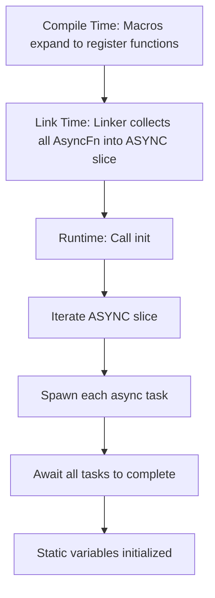

# xboot : Async Static Initialization Before Main

Pair with [static_](https://crates.io/crates/static_) for simplified usage.

## Table of Contents

- [Introduction](#introduction)
- [Features](#features)
- [Installation](#installation)
- [Usage](#usage)
- [Design](#design)
- [Tech Stack](#tech-stack)
- [Project Structure](#project-structure)
- [API Reference](#api-reference)
- [History](#history)

## Introduction

xboot enables async initialization of static variables before program execution begins. Built on [linkme](https://github.com/dtolnay/linkme)'s distributed slice mechanism, it collects async initialization functions at compile time and executes them at runtime startup.

Typical use cases include establishing database connections, initializing Redis clients, or setting up other resources that require async operations as module-level static variables.

## Features

- Async static variable initialization
- Zero-cost compile-time collection via linker sections
- Cross-platform support (Linux, macOS, Windows)
- Simple macro-based API
- Compatible with tokio runtime

## Installation

Add to your `Cargo.toml`:

```toml
[dependencies]
xboot = "0.1"
```

## Usage

```rust
use aok::{OK, Result};
use tokio::time::{Duration, sleep};
use log::info;

pub struct Client {}

impl Client {
  pub async fn test(&self) {
    info!("client test success");
  }
}

pub async fn connect() -> Result<Client> {
  info!("Sleeping for 3 seconds...");
  sleep(Duration::from_secs(3)).await;
  Ok(Client {})
}

// Register async initialization
static_::init!(CLIENT: Client {
  connect().await
});

#[tokio::main]
async fn main() -> Result<()> {
  // Execute all registered initializations
  static_::init().await?;
  info!("inited");
  CLIENT.test().await;
  OK
}
```

## Design

xboot leverages linkme's distributed slice to collect initialization functions across the crate dependency graph at link time.

### Initialization Flow



### Core Components

1. `ASYNC` - Distributed slice storing all async initialization functions
2. `AsyncFn` - Type alias for functions returning `JoinHandle<Result<()>>`
3. `init()` - Iterates and awaits all registered initialization tasks
4. `add!` - Macro to register initialization expressions

### How It Works

The `add!` macro:
1. Generates unique function name using `gensym`
2. Wraps async initialization in `tokio::task::spawn`
3. Registers function pointer to `ASYNC` distributed slice via `#[distributed_slice]`

At runtime, `init()` iterates through `ASYNC` and awaits each spawned task sequentially.

## Tech Stack

| Crate | Purpose |
|-------|---------|
| [linkme](https://crates.io/crates/linkme) | Distributed slice for compile-time collection |
| [tokio](https://crates.io/crates/tokio) | Async runtime and task spawning |
| [paste](https://crates.io/crates/paste) | Macro identifier concatenation |
| [gensym](https://crates.io/crates/gensym) | Unique symbol generation |
| [aok](https://crates.io/crates/aok) | Result type utilities |

## Project Structure

```
xboot/
├── Cargo.toml
├── src/
│   └── lib.rs      # Core implementation
└── tests/
    ├── Cargo.toml
    └── src/
        └── main.rs # Usage example
```

## API Reference

### Types

| Type | Description |
|------|-------------|
| `Task` | `tokio::task::JoinHandle<Result<()>>` |
| `AsyncFn` | `fn() -> Task` |
| `ASYNC` | `[AsyncFn]` distributed slice |

### Functions

| Function | Description |
|----------|-------------|
| `init() -> Result<()>` | Execute all registered async initializations |

### Macros

| Macro | Description |
|-------|-------------|
| `add!(expr)` | Register async initialization expression |

### Re-exports

- `gensym::gensym`
- `linkme::distributed_slice`
- `paste::paste`
- `tokio`

## History

The challenge of static variable initialization has deep roots in systems programming. In C++, the "static initialization order fiasco" has plagued developers since the language's early days—when static variables across translation units depend on each other, their initialization order is undefined, leading to subtle bugs.

The ELF binary format addressed part of this through `.init` and `.ctors` sections, allowing constructors to run before `main()`. However, this "life before main" approach conflicts with Rust's safety guarantees and doesn't support async operations.

David Tolnay's [linkme](https://github.com/dtolnay/linkme) crate brought a elegant solution: using `link_section` attributes to collect static elements into contiguous binary sections at link time, without runtime initialization overhead. This zero-cost abstraction operates entirely during compilation and linking.

xboot builds upon linkme to extend this pattern into the async world, enabling modern Rust applications to initialize resources like database connections before the main logic begins—combining the convenience of global state with the safety of explicit initialization.
