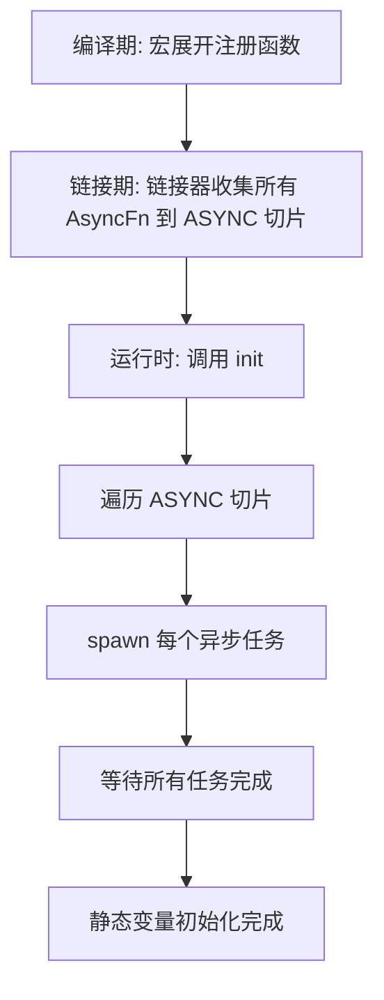

# xboot : 主函数前异步初始化静态变量

配合 [static_](https://crates.io/crates/static_) 简化使用。

## 目录

- [简介](#简介)
- [特性](#特性)
- [安装](#安装)
- [使用](#使用)
- [设计](#设计)
- [技术栈](#技术栈)
- [项目结构](#项目结构)
- [API 参考](#api-参考)
- [历史](#历史)

## 简介

xboot 支持在程序启动前异步初始化静态变量。基于 [linkme](https://github.com/dtolnay/linkme) 的分布式切片机制，在编译期收集异步初始化函数，运行时启动阶段执行。

典型场景：将数据库连接、Redis 客户端等需要异步操作的资源设置为模块级静态变量。

## 特性

- 异步静态变量初始化
- 零开销编译期收集（通过链接器段）
- 跨平台支持（Linux、macOS、Windows）
- 简洁的宏 API
- 兼容 tokio 运行时

## 安装

在 `Cargo.toml` 中添加：

```toml
[dependencies]
xboot = "0.1"
```

## 使用

```rust
use aok::{OK, Result};
use tokio::time::{Duration, sleep};
use log::info;

pub struct Client {}

impl Client {
  pub async fn test(&self) {
    info!("client test success");
  }
}

pub async fn connect() -> Result<Client> {
  info!("Sleeping for 3 seconds...");
  sleep(Duration::from_secs(3)).await;
  Ok(Client {})
}

// 注册异步初始化
static_::init!(CLIENT: Client {
  connect().await
});

#[tokio::main]
async fn main() -> Result<()> {
  // 执行所有注册的初始化
  static_::init().await?;
  info!("inited");
  CLIENT.test().await;
  OK
}
```

## 设计

xboot 利用 linkme 的分布式切片，在链接期跨 crate 依赖图收集初始化函数。

### 初始化流程



### 核心组件

1. `ASYNC` - 存储所有异步初始化函数的分布式切片
2. `AsyncFn` - 返回 `JoinHandle<Result<()>>` 的函数类型别名
3. `init()` - 遍历并等待所有注册的初始化任务
4. `add!` - 注册初始化表达式的宏

### 工作原理

`add!` 宏：
1. 使用 `gensym` 生成唯一函数名
2. 将异步初始化包装在 `tokio::task::spawn` 中
3. 通过 `#[distributed_slice]` 将函数指针注册到 `ASYNC` 分布式切片

运行时，`init()` 遍历 `ASYNC` 并顺序等待每个 spawn 的任务。

## 技术栈

| Crate | 用途 |
|-------|------|
| [linkme](https://crates.io/crates/linkme) | 分布式切片，编译期收集 |
| [tokio](https://crates.io/crates/tokio) | 异步运行时和任务 spawn |
| [paste](https://crates.io/crates/paste) | 宏标识符拼接 |
| [gensym](https://crates.io/crates/gensym) | 唯一符号生成 |
| [aok](https://crates.io/crates/aok) | Result 类型工具 |

## 项目结构

```
xboot/
├── Cargo.toml
├── src/
│   └── lib.rs      # 核心实现
└── tests/
    ├── Cargo.toml
    └── src/
        └── main.rs # 使用示例
```

## API 参考

### 类型

| 类型 | 描述 |
|------|------|
| `Task` | `tokio::task::JoinHandle<Result<()>>` |
| `AsyncFn` | `fn() -> Task` |
| `ASYNC` | `[AsyncFn]` 分布式切片 |

### 函数

| 函数 | 描述 |
|------|------|
| `init() -> Result<()>` | 执行所有注册的异步初始化 |

### 宏

| 宏 | 描述 |
|----|------|
| `add!(expr)` | 注册异步初始化表达式 |

### 重导出

- `gensym::gensym`
- `linkme::distributed_slice`
- `paste::paste`
- `tokio`

## 历史

静态变量初始化问题在系统编程中由来已久。C++ 的"静态初始化顺序灾难"困扰开发者多年——当跨编译单元的静态变量相互依赖时，初始化顺序未定义，导致隐蔽 bug。

ELF 二进制格式通过 `.init` 和 `.ctors` 段部分解决了这个问题，允许构造函数在 `main()` 前运行。但这种"main 前生命周期"方式与 Rust 的安全保证冲突，且不支持异步操作。

David Tolnay 的 [linkme](https://github.com/dtolnay/linkme) crate 带来了优雅方案：使用 `link_section` 属性在链接期将静态元素收集到连续的二进制段中，无运行时初始化开销。这种零开销抽象完全在编译和链接阶段完成。

xboot 基于 linkme 将此模式扩展到异步领域，使现代 Rust 应用能在主逻辑开始前初始化数据库连接等资源——兼顾全局状态的便利性与显式初始化的安全性。
